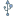

## 隱私安全

增加隱私保護與系統安全性

---

### [Acrylic DNS Proxy](http://mayakron.altervista.org/wikibase/show.php?id=AcrylicHome)    

本地 DNS 代理，快取 DNS 伺服器回應並通過設定 hosts 檔案防止惡意廣告

* [中文編譯版頁面](https://github.com/miaomiaosoft/Acrylic-DNS-Proxy-GUI)

### [AdwCleaner](https://toolslib.net/downloads/viewdownload/1-adwcleaner/)  

免費清理工具，針對廣告軟體、PUP/LPI、惡意工作列跟劫持軟體

### Authy Desktop  

###### [Official Site](https://authy.com/)｜[Download Page](https://authy.com/download/)

在多終端之間同步你的 2FA 資訊

### [Buttercup](https://buttercup.pw/)    

使用 JavaScript，外觀優雅、功能簡潔的密碼管理器，與 Keepass、1Password 等資料庫相容。

### CCleaner  

###### [官網](https://www.piriform.com/CCLEANER)｜[下載頁面](https://www.piriform.com/ccleaner/download/standard)

輕量 PC 最佳化工具，屢獲殊榮

### [Comodo Firewall](https://personalfirewall.comodo.com/) 

個人防火牆與HIPS防護

### Cryptomator   

###### [官網](https://cryptomator.org/)｜[下載頁面](https://cryptomator.org/downloads/#allVersions)

加密你的雲端檔案

### [Encrypto](http://macpaw.com/encrypto) 

優雅地加密檔案

### [GlassWire](https://www.glasswire.com/)  

網路通訊活動監視並視覺化顯示

### KeePass    

###### [官網](http://keepass.info/)｜[下載頁面](http://keepass.info/download.html)

開源密碼管理器

### LastPass   

###### [官網](https://www.lastpass.com/)｜[下載頁面](https://lastpass.com/misc_download2.php?tab=windows)

強大的全能密碼生成管理器，具有免費跨平台雲端同步

### NetLimiter 

###### [官網](https://www.netlimiter.com/)｜[下載頁面](https://www.netlimiter.com/download)

網路通訊控制與監視工具

### [Pcap\_DNSProxy](https://github.com/chengr28/Pcap_DNSProxy)   

使用 WinPcap/LibPcap 用於過濾 DNS 投毒污染的工具，支援多伺服器並列請求能以提高在惡劣網路環境下域名解析的可靠性

### [RevokeChinaCerts](https://github.com/chengr28/RevokeChinaCerts)     

全自動吊銷可疑及非法憑證

### [Sandboxie](http://www.sandboxie.com/) 

使用沙盒的隔離軟體

### [Simple DNSCrypt](https://simplednscrypt.org/)  

簡單的 DNSCrypt 管理工具，可用於預防 DNS 污染

### [VeraCrypt](https://www.veracrypt.fr/en/Home.html)    

開源、跨平台的磁碟加密軟體

### [XX-Net](https://github.com/XX-net/XX-Net)    

網路代理工具
